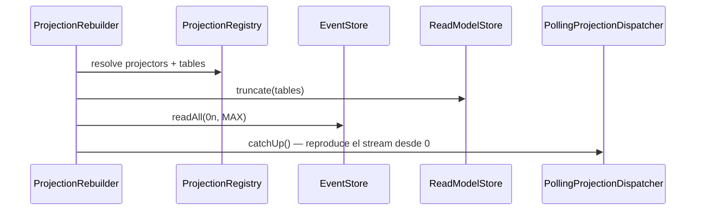

# Rebuild projection

Reconstruye una proyección desde cero truncando sus tablas del read model y su
checkpoint, y re-ejecutando cada evento del stream a través de los mismos
proyectores que el dispatch incremental original. El resultado es idéntico al
que produjo el dispatch en vivo.

## Reglas

- **AC-1:** `rebuild(projectionName)` resuelve los proyectores y tablas desde
  `ProjectionRegistry`, trunca las tablas y el checkpoint, y reproduce el stream
  completo desde la posición 0 vía `PollingProjectionDispatcher.catchUp()`.
- **AC-2:** Solo las tablas de la proyección especificada son truncadas. Las
  demás proyecciones no se modifican.
- **AC-4:** Ejecutar `rebuild` dos veces produce el mismo estado final (idempotente
  por upsert con clave).
- **AC-6:** Solo lee del EventStore (`readAll`), nunca invoca `append`.
- **INV-12:** El stream nunca se edita ni se borra.

## Errores

| Condición | Excepción | Comportamiento |
|---|---|---|
| Nombre de proyección no registrado en `ProjectionRegistry` | Error (CLI aborta) | El script termina con código ≠ 0 y mensaje descriptivo |
| `EventStore.readAll` lanza error | Error de infraestructura | Se propaga; el CLI muestra el stack trace |
| Fallo de conexión a PostgreSQL | `DataSource` error | El CLI termina con código ≠ 0 |

## Respuesta

El CLI imprime el nombre de la proyección, el número de eventos aplicados y
confirma que el checkpoint alcanzó la última posición del stream.
