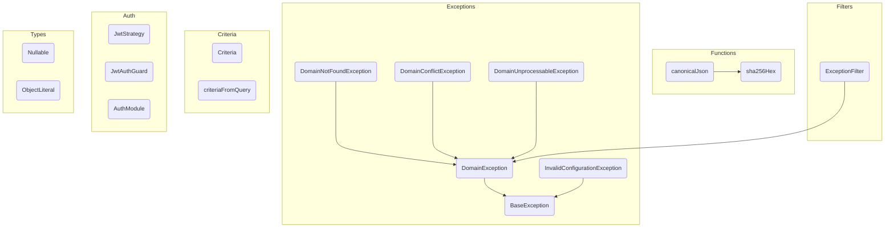

# libs/shared — Utilidades transversales del monorepo

> C4 Nivel 3 · documentación viva. Los nodos nombran la clase real; el gate de CI
> (`npm run docs:validate`) falla si alguno deja de existir.

## Propósito

Librería compartida entre `apps/finances` y `apps/ledger`. Provee tipos genéricos
(`Nullable<T>`, `ObjectLiteral`), jerarquía de excepciones de dominio
(`DomainException`, `BaseException`), filtro global de errores HTTP
(`ExceptionFilter`), funciones de hashing criptográfico (`canonicalJson`, `sha256Hex`),
el patrón `Criteria` para queries tipadas, y el módulo de autenticación OIDC
(`AuthModule`, `JwtStrategy`).

No contiene handlers, controllers ni projectors — es una librería de soporte, no un
módulo de negocio. El gate inverso (código → diagrama) no le aplica.

## Diagramas

**Componentes (C4 Nivel 3).**

## Notas

- `Money` existe en dos versiones independientes: `apps/finances/src/shared/domain/money.ts`
  (basada en `number`) y `apps/ledger/src/shared/domain/money/money.ts` (basada en `Big`).
  Los diagramas de cada app referencian su propia versión.
- Esta unidad no tiene `flows/` porque no expone casos de uso propios. Los símbolos que
  otras unidades nombran (`canonicalJson`, `sha256Hex`, `DomainException`) están
  documentados en el diagrama de componentes de arriba.
