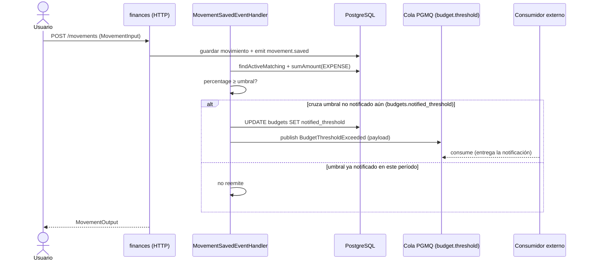
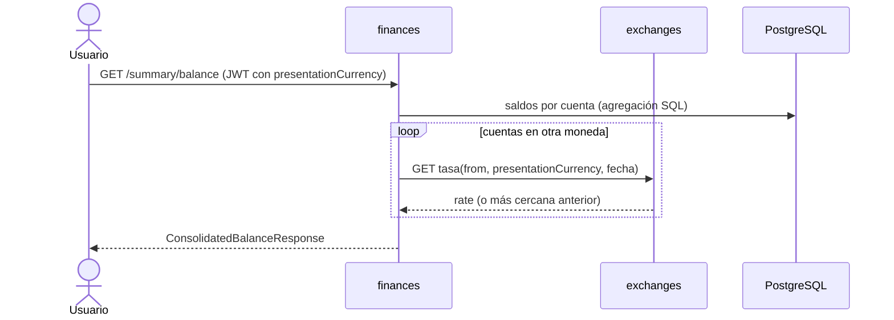
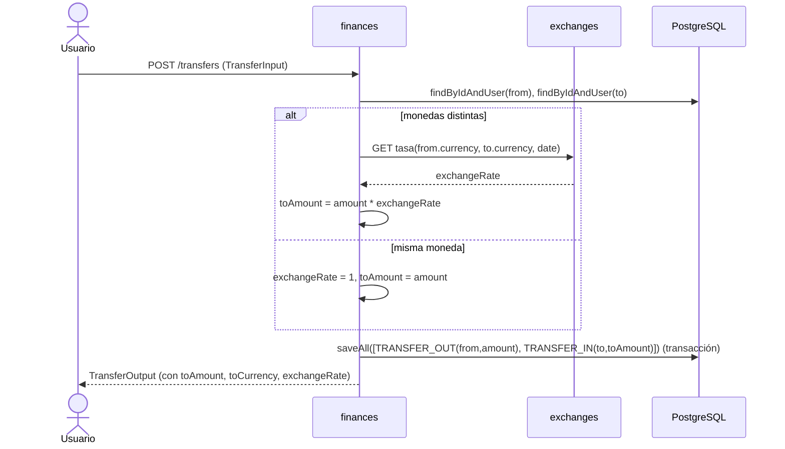
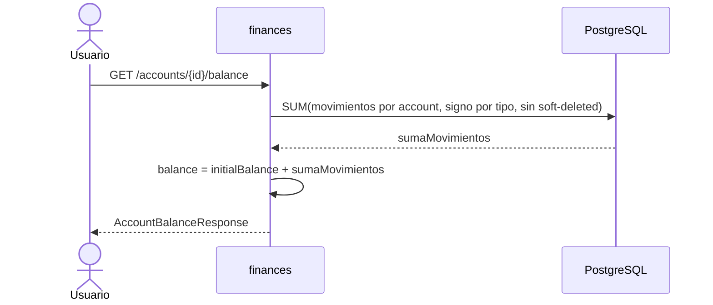
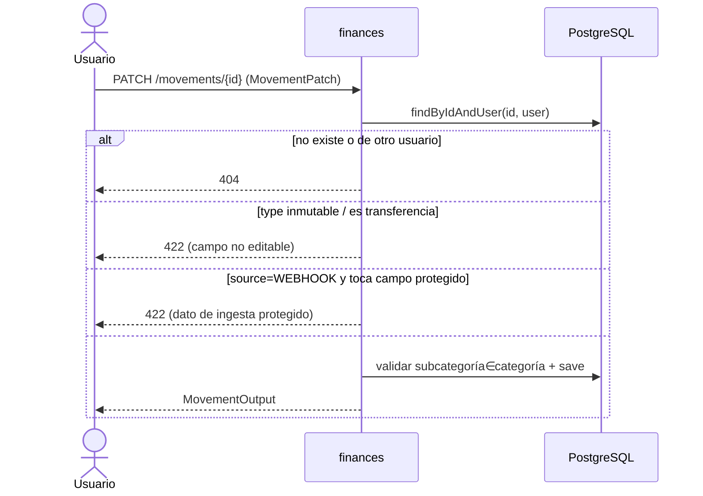
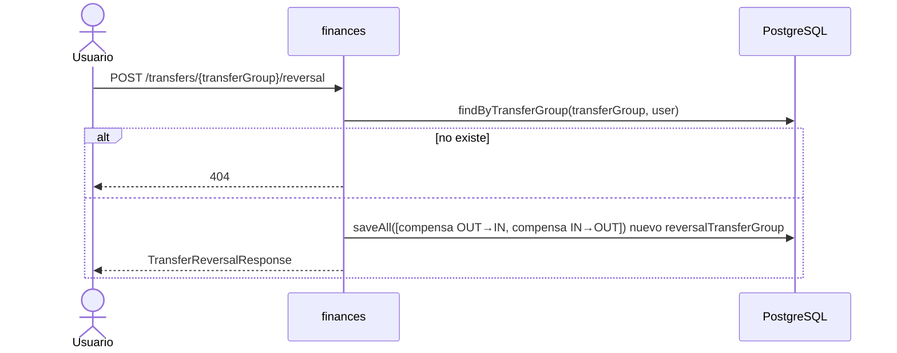
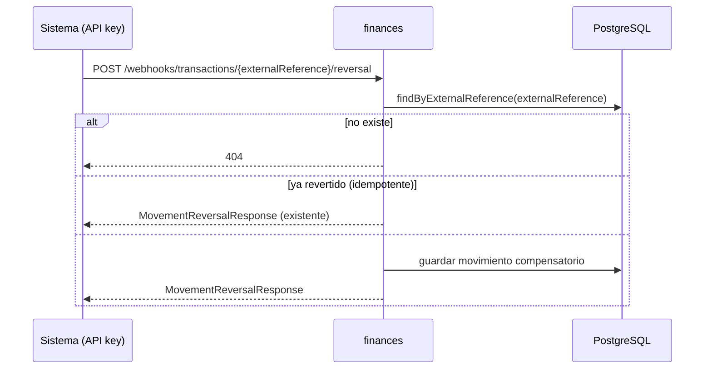

# Diagrama de flujo: sm-0001

Historia transversal: un diagrama por flujo relevante. Todos ocurren en el microservicio **finances** salvo donde se indique el hop a `users` o `exchanges`.

## AC-1 — Notificación de umbral de presupuesto (mensajería async)

## AC-2 — Balance consolidado en moneda de presentación

## AC-2 — Transferencia cross-currency

## AC-3 — Saldo vivo por cuenta

## AC-4 — Edición de movimiento

## AC-5 — Anular transferencia (reversa compensatoria)

## AC-6 — Reversa de movimiento de webhook

