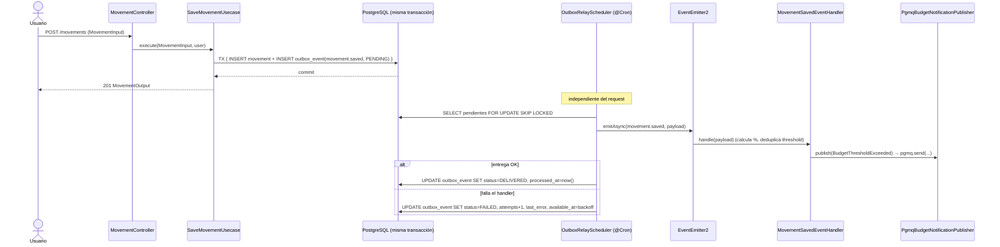
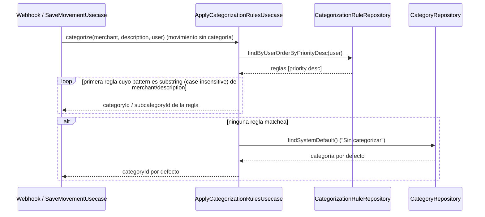
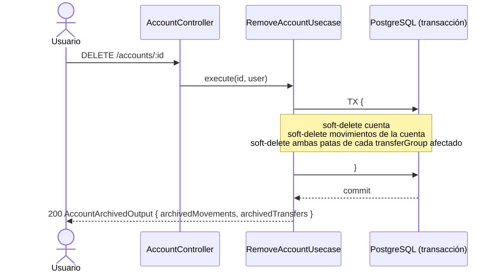

# Diagrama de flujo: sm-0003

Todo ocurre dentro de la app `finances` (monolito). Los "participantes" son módulos
internos, no microservicios separados. Se muestran los cuatro flujos con interacción
relevante; AC-5 (archivado en cascada) se incluye como flujo de borrado.

## AC-1 · AC-3 — Crear transferencia con validación de saldo e idempotencia

```mermaid
sequenceDiagram
  actor Usuario
  participant TC as TransferController
  participant II as IdempotencyInterceptor
  participant CT as CreateTransferUsecase
  participant AR as AccountRepository
  participant MR as MovementRepository

  Usuario->>TC: POST /transfers (TransferInput, header Idempotency-Key)
  TC->>II: intercepta
  II->>II: hash(body); busca (user_id, key)
  alt clave existente + mismo hash (COMPLETED)
    II-->>Usuario: respuesta original almacenada (replay)
  else clave existente + hash distinto
    II-->>Usuario: 422 IdempotencyConflict
  else clave nueva (o sin header)
    II->>CT: execute(TransferInput, user)
    CT->>AR: findByIdAndUser(sourceAccountId) + movementBalance
    alt saldo insuficiente y allowNegativeBalance=false
      CT-->>II: InsufficientBalanceException
      II-->>Usuario: 422 InsufficientBalance
    else saldo OK o cuenta admite negativo
      CT->>MR: saveAll([TRANSFER_OUT, TRANSFER_IN]) (transferGroup)
      MR-->>CT: par de movimientos
      CT-->>II: TransferOutput
      II->>II: persiste respuesta (idempotency_keys → COMPLETED, expires_at=+24h)
      II-->>Usuario: 201 TransferOutput
    end
  end
```

## AC-2 — Outbox transaccional + relay in-process



## AC-4 — Auto-categorización por reglas



## AC-5 — Archivado de cuenta en cascada


