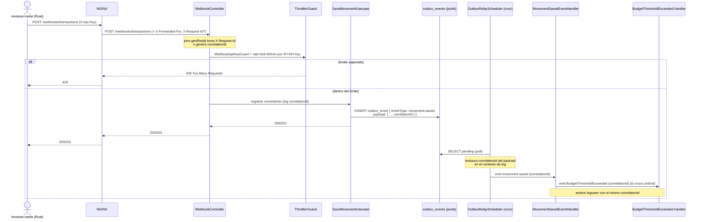
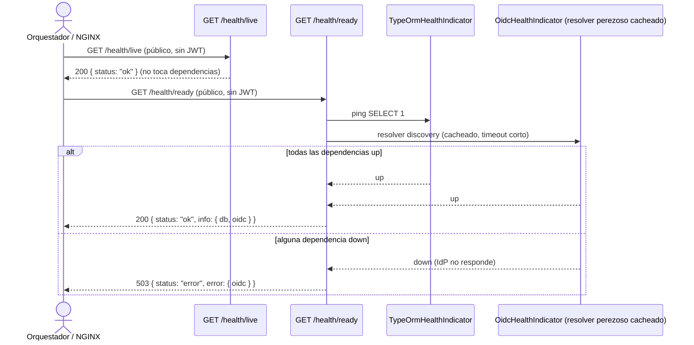

# Diagrama de flujo: sm-0004

Historia no-funcional transversal. Se diagraman los dos flujos con forma de secuencia:
la observabilidad de punta a punta (AC-4) y el readiness (AC-2). El resto de los ACs
(Swagger, discovery perezoso, rate limiting) son cross-cutting sin un flujo de secuencia
propio; su detalle vive en `design.md` y `research.md`.

## Flujo 1 — Trace id de punta a punta: webhook → evento de presupuesto (AC-4, AC-5)

## Flujo 2 — Readiness / liveness (AC-2, AC-3)

