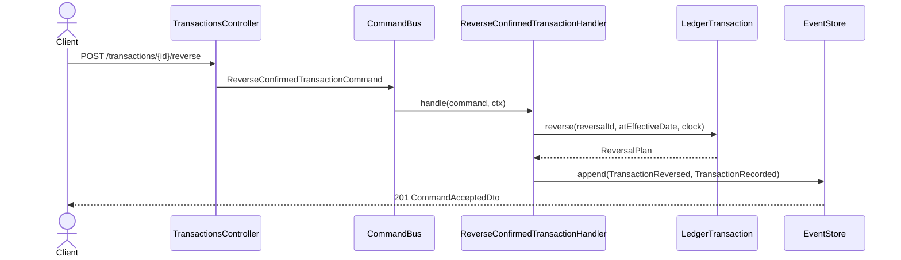
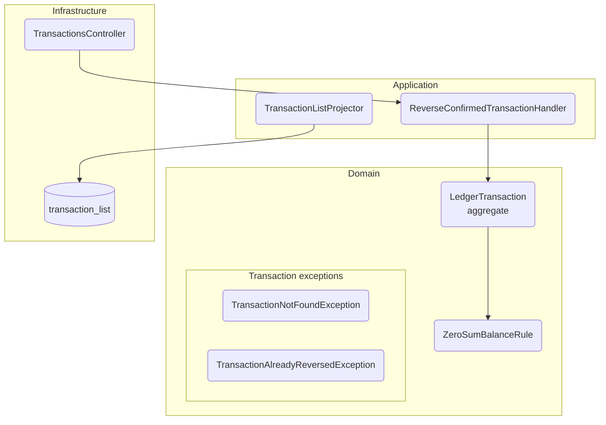

# Propuesta: documentación como código con Mermaid

> **Estado:** borrador de `spec-0033`. Al cerrar la historia se promueve a
> `docs/proposals/docs-as-code-mermaid.md` (AC-8) y supersede a
> `docs/proposals/docs-as-code-likec4.md`.
>
> **Este documento es el contrato de formato de la migración.** Los ~50 archivos que
> `/plan` va a tocar siguen las plantillas de acá al pie de la letra. Aprobarlo es
> aprobar la migración entera.

## Por qué se reemplaza LikeC4

El enfoque LikeC4 (vigente desde 2026-07-24) resolvía un problema real —una fuente de
verdad única para 104 componentes y 47 flujos— pero cobraba tres peajes que superaron el
beneficio:

1. **Los diagramas nunca se vieron.** Nunca se generó un solo SVG: no existe
   `docs/.likec4-export` ni ninguna carpeta `assets/`. Verlos exigía `likec4 start`.
2. **El diagrama vivía separado de su semántica.** 40 `flows/*.md` con la sustancia, 47
   `dynamic view` con el dibujo, unidas por una clave `view:` en el frontmatter.
3. **La maquinaria de delta costaba ~120 líneas de instrucciones** en `/design` y
   `/sync`, y solo se justificaba por el modelo único.

Mermaid renderiza nativo en GitHub, en el preview de VS Code y en un PR. El costo que se
acepta a cambio está en la sección «Lo que se pierde».

## Reparto de artefactos por nivel C4

| Nivel | Artefacto | Diagrama | Quién lo mantiene |
|---|---|---|---|
| **L1 — Context** | `docs/architecture/context.md` | `flowchart` — actores y sistemas externos | `/architecture` |
| **L2 — Container** | `docs/architecture/containers.md` | `flowchart` — apps, libs, integraciones | `/architecture` |
| **L3 — Component** | `<unidad>/README.md` | `flowchart` + subgraphs por capa | `/design` → `/sync` |
| **L4 — Flujo** | `<unidad>/flows/<use-case>.md` | `sequenceDiagram` **inline** | `/design` → `/sync` |

Regla: **una fuente de verdad por nivel.** No hay modelo global ni archivo de modelo
aparte. El diagrama vive dentro del documento que lo explica.

### Qué es una «unidad de documentación»

Una unidad es **una raíz de código con su documentación al lado**. No es sinónimo de
«módulo del app»: una lib compartida también es una unidad.

| Unidad | Documentación | Código |
|---|---|---|
| Módulo del ledger | `apps/ledger/docs/<module>/` | `apps/ledger/src/<module>/` |
| Lib compartida | `libs/<lib>/docs/` | `libs/<lib>/src/` |

**Regla dura: la documentación vive junto al código que describe.** Si el código se mueve,
su documentación se mueve con él, en el mismo cambio.

> Esta regla no es teórica. `apps/ledger/docs/shared-kernel/` sobrevivió dos semanas
> documentando código extraído a `libs/cqrs` el 2026-07-27, mientras `libs/cqrs/README.md`
> describía lo mismo por su cuenta. El modelo LikeC4 lo ocultaba declarando esos
> componentes bajo el FQN `admin.ledger.shared.*` — el modelo afirmaba una pertenencia que
> el árbol de archivos ya había desmentido. Esta migración lo corrige moviendo la carpeta
> a `libs/cqrs/docs/`.

---

## Plantilla 1 — Flujo (`flows/<use-case>.md`)

El frontmatter conserva todas sus claves **salvo `view:`**, que desaparece por quedarse
sin referente.

````markdown
---
use_case: reverse-transaction
module: transactions
trigger: rest
entrypoint: POST /transactions/{id}/reverse
command: ReverseConfirmedTransactionCommand
invariants: [AC-1, AC-2, INV-6, INV-7]
introduced_by: hu-0014
last_modified_by: hu-0026
status: active
---

# Reversar transacción confirmada

<prosa del caso de uso — incorpora el `title` y el `description` que tenía la
`dynamic view`, que no se descartan>



## Reglas
## Errores
## Respuesta
````

### Reglas de traducción `dynamic view` → `sequenceDiagram`

La conversión es **1:1 y sin interpretación**. No se enriquece, no se corrige, no se
reordena:

| En LikeC4 | En Mermaid |
|---|---|
| `origen -> destino 'mensaje'` | `origen->>destino: mensaje` |
| Retorno al iniciador | `-->>` |
| `title` de la vista | encabezado o primera línea de prosa del `.md` |
| `description` de la vista | prosa del `.md` — **nunca se descarta** |
| `autoLayout TopBottom` | se descarta (Mermaid no lo necesita) |
| Nodo `user` | `actor Client` |

**No se usan `alt`/`opt`/`loop`** salvo que la vista original ya expresara la
ramificación. Los errores siguen viviendo en la tabla `## Errores`, que es donde ya
estaban y donde se leen mejor.

---

## Plantilla 2 — Componentes del módulo (`README.md`)

````markdown
## Diagramas


````

Reglas:

- `flowchart TB` — nunca `graph TB`, que es la forma legada. Los dos bloques existentes
  en `docs/architecture/` se normalizan.
- **Nunca `C4Context` ni `C4Component`.** Siguen experimentales en Mermaid y layoutean mal.
- Un subgraph por capa hexagonal: `domain`, `application`, `infrastructure`.
- Las familias de excepciones y de eventos son **subgraphs anidados**, no nodos.

---

## Convención de identificadores (el contrato del gate)

Es lo único que sostiene la correspondencia entre diagrama y código ahora que no hay
modelo único. La **forma del nodo declara su clase**, y de ahí sale si debe resolver:

| Forma | Clase | ¿Debe resolver a un símbolo? |
|---|---|---|
| `X("Nombre")` / `X[Nombre]` | símbolo de código | **Sí** |
| `X[("nombre_tabla")]` (cilindro) | almacenamiento / read model | No |
| `subgraph id["Etiqueta"]` | agrupación conceptual | No |
| `participant X as Nombre` | símbolo de código | **Sí** — resuelve `Nombre`, no `X` |
| `actor Nombre` | actor externo | No |

**En `sequenceDiagram`, lo que se verifica es el nombre visible** —lo que sigue a `as`,
o el nombre solo cuando no hay `as`. El alias (`CB`, `H`, `ES`) queda libre para la
legibilidad. Es la convención que el repo ya practicaba en
`shared-kernel/diagram.md` (`participant CB as PolicyCommandBus`).

**Lista blanca de actores externos:** `Client`, `User`, `Usuario`, `Postgres`, `Keycloak`.
Es la única exención por nombre, y es corta a propósito — todo lo demás se exime por su
forma, que se ve en el diagrama en vez de esconderse en el script.

---

## El gate de CI

`ts-node tools/validate-diagrams.ts`, invocado por el script npm `docs:validate` en el
job `docs` de `.github/workflows/ci.yml` — el mismo job, solo cambia el comando.

**Alcance:** únicamente los `.md` de las unidades de documentación —
`apps/<app>/docs/<module>/**` y `libs/<lib>/docs/**`. Los diagramas L1/L2 de
`docs/architecture/` quedan fuera: sus nodos son actores y containers, no clases, y
exigirles resolución no tendría sentido.

**Dirección: diagrama → código, y solo esa.** Se verifica que lo diagramado exista. No se
verifica que todo lo codificado esté diagramado — esa dirección exigiría definir qué
símbolos son documentables y hoy dejaría el CI en rojo.

**Resolución de símbolo:**

```
^\s*export\s+(default\s+)?(declare\s+)?(abstract\s+)?(async\s+)?(class|interface|type|enum|const|let|function|function\*)\s+<Nombre>\b
```

sobre los `.ts` (excluyendo `*.spec.ts`) de las raíces de la unidad:

| Unidad de doc | Raíz de código |
|---|---|
| `apps/ledger/docs/accounts` | `apps/ledger/src/accounts` |
| `apps/ledger/docs/reconciliation` | `apps/ledger/src/reconciliation` |
| `apps/ledger/docs/reference` | `apps/ledger/src/reference` |
| `apps/ledger/docs/transactions` | `apps/ledger/src/transactions` |
| `apps/ledger/docs/shared` | `apps/ledger/src/shared` |
| `libs/cqrs/docs` | `libs/cqrs/src` |

**más las raíces compartidas, añadidas siempre:** `libs/cqrs`, `libs/shared`,
`apps/ledger/src/shared`. Sin ellas, el módulo `shared` del ledger no podría nombrar a
`DryRunPolicy` ni a `RetryPolicy`, que viven en `libs/cqrs` — y documentar la política
transversal que gobierna al adaptador HTTP es legítimo, no un cruce de frontera.

El mapa es explícito aunque sea 1:1: hace visible qué unidades existen y contra qué se
validan. La derivación implícita es lo que permitió que una carpeta de docs sobreviviera
dos semanas apuntando a código mudado.

**Salida:** recorre todo y reporta **todas** las rupturas antes de terminar (no se detiene
en la primera), con `<archivo>:<línea>` e identificador. Exit `1` si hubo alguna, `0` si
no — la misma convención CLI/CI que ya usan las herramientas del repo.

---

## Efecto sobre el pipeline SDD

Sin modelo global que mergear, el mecanismo delta/reconcile pierde su razón de ser **para
los diagramas**:

| Clave | Antes | Ahora |
|---|---|---|
| `DIAGRAM_FORMAT` | LikeC4 (`.c4`) | Mermaid inline |
| `DOCS_MODEL` | modelo único fusionado | sin modelo: un diagrama por artefacto |
| `DOCS_LANDSCAPE_MODEL` | `docs/architecture/landscape.c4` | *(se elimina)* |
| `DOCS_MODULE_MODEL` | `<module>.c4` | *(se elimina — el L3 vive en el README)* |
| `DESIGN_OUTPUT_MODE` | `delta` (`model.delta.c4`) | `flows/*.md` completo |
| `SYNC_MODE` | `reconcile` | `replace` |
| `MODEL_VALIDATE_CMD` | `npx likec4 validate` | `ts-node tools/validate-diagrams.ts` |
| **`API_CONTRACT_MODE`** | **`delta`** | **`delta` — no cambia** |

`API_CONTRACT_MODE` sobrevive intacto porque el `api.yaml` canónico por módulo **sí** es
un artefacto acumulativo real: esa mitad del mecanismo nunca dependió de LikeC4.

Desaparecen: los tags `#delta-new`/`#delta-changed`, los prefijos `[NEW]`/`[CHANGED]` en
títulos de vista, y los workarounds de resolución de FQN dentro de bloques `extend`.

---

## Lo que se pierde (y por qué se acepta)

Honestidad sobre el costo, para que no se relitige en cada review:

1. **Repetición de nombres.** Un componente que participa en N flujos se nombra N veces.
   Sin modelo único no hay forma de evitarlo. **Se acepta:** el gate de identificadores
   es lo que impide que la repetición derive en divergencia.
2. **No hay vista global navegable.** El explorador de LikeC4 permitía entrar de un
   módulo a sus componentes con un click. **Se acepta:** era la mejor característica del
   enfoque anterior, pero exigía un dev server para usarse.
3. **No hay validación referencial entre diagramas.** Nada verifica que el
   `TransactionsController` del flujo A sea el mismo nodo que el del flujo B. **Se acepta
   parcialmente:** ambos deben resolver al mismo símbolo del código, que es el ancla
   común.
4. **El diagrama de componentes se mantiene a mano.** No se deriva del código. **Se
   acepta:** cablear un generador (`nx graph`, dependency-cruiser) agrega una dependencia
   que el Simplicity Gate no justifica, y el gate ya impide que un nodo nombre algo
   inexistente.
