# Componentes: shared-kernel — subsistema de proyecciones (apps/ledger)

> C4 Nivel 3 — building blocks internos del módulo `shared-kernel`.
> Diagrama acumulativo: incluye componentes de `hu-0001` (event store), `hu-0002` (repository +
> contract tests), y lo nuevo de `hu-0004` (subsistema de proyecciones: puertos, adaptadores,
> contract test reutilizable).

```mermaid
graph TD
  subgraph domain["Domain Layer"]
    EV("EventEnvelope
    type")
    SE("StoredEvent
    type")
    SID("StreamId
    type")
    AR("AppendResult
    type")
    EP("EventPayload
    type")
    ES_PORT("EventStore
    abstract class")
    CCE("ConcurrencyConflictException")
    DRE("DuplicateExternalRefException")
  end

  subgraph application["Application Layer"]
    ESR("EventSourcedRepository&lt;TAggregate&gt;
    abstract class
    ⚡ AC-11 guard")
    EF("EnvelopeFactory
    class")
    ER("EventRegistry
    abstract class")

    %% Projection subsystem (hu-0004)
    RMS_PORT("ReadModelStore
    abstract class
    ⚡ +hu-0004")
    PROJ("Projector
    abstract class
    ⚡ +hu-0004")
    PD_PORT("ProjectionDispatcher
    abstract class
    ⚡ +hu-0004")
    CPR_PORT("ProjectionCheckpointRepository
    abstract class
    ⚡ +hu-0004")
    RMK("ReadModelKey / ReadModelRow
    types ⚡ +hu-0004")
  end

  subgraph infrastructure["Infrastructure Layer"]
    IMES("InMemoryEventStore
    ⚡ AC-11 guard")
    PES("PostgresEventStore")
    CT("describeEventStoreContract()
    ⚡ +AC-11 test")
    ESR_TEST("PostgresEventStoreRow")

    %% Projection adapters (hu-0004)
    SYNC("SynchronousProjectionDispatcher
    ⚡ +hu-0004: read-your-writes (RNF-9)")
    POLL("PollingProjectionDispatcher
    ⚡ +hu-0004: checkpoint-based async")
    IM_RMS("InMemoryReadModelStore
    ⚡ +hu-0004: testing double")
    PG_RMS("PostgresReadModelStore
    ⚡ +hu-0004: production adapter")
    IM_CPR("InMemoryProjectionCheckpointRepository
    ⚡ +hu-0004: testing double")
    REB("ProjectionRebuilder
    ⚡ +hu-0004: RNF-5 rebuild tooling")
  end

  subgraph testing["Testing Layer"]
    ES_CONTRACT("event-store.contract.ts
    suite parametrizada")
    RMS_CONTRACT("read-model-store.contract.ts
    ⚡ +hu-0004: describeReadModelStoreContract()
    suite parametrizada")
  end

  %% Event Store wiring (existing)
  ES_PORT --> EV
  ES_PORT --> SE
  ES_PORT --> SID
  ES_PORT --> AR
  ES_PORT --> CCE
  ES_PORT --> DRE
  IMES --> ES_PORT
  PES --> ES_PORT
  ESR --> ES_PORT
  ESR --> EF
  ESR --> ER
  EF --> EV
  EF --> SID
  ES_CONTRACT --> ES_PORT
  ES_CONTRACT --> EV
  ES_CONTRACT --> SID
  ES_CONTRACT --> CCE
  ES_CONTRACT --> DRE
  IMES -.-> ES_CONTRACT
  PES -.-> ES_CONTRACT

  %% Projection subsystem wiring (hu-0004)
  PROJ --> SE
  PROJ --> RMS_PORT
  PD_PORT --> SE
  SYNC --> PD_PORT
  SYNC --> PROJ
  SYNC --> RMS_PORT
  POLL --> PD_PORT
  POLL --> PROJ
  POLL --> RMS_PORT
  POLL --> ES_PORT
  POLL --> CPR_PORT
  REB --> ES_PORT
  REB --> RMS_PORT
  REB --> CPR_PORT
  REB --> POLL
  IM_RMS --> RMS_PORT
  PG_RMS --> RMS_PORT
  IM_CPR --> CPR_PORT
  RMS_PORT --> RMK
  RMS_CONTRACT --> RMS_PORT
  RMS_CONTRACT --> RMK
  IM_RMS -.-> RMS_CONTRACT
  PG_RMS -.-> RMS_CONTRACT
```

## Componentes nuevos en hu-0004

| Capa | Componente | Archivo |
|------|-----------|---------|
| Application | `ReadModelStore` (puerto) | `shared-kernel/application/projection/read-model-store.ts` |
| Application | `Projector` (base abstracta) | `shared-kernel/application/projection/projector.ts` |
| Application | `ProjectionDispatcher` (puerto) | `shared-kernel/application/projection/projection-dispatcher.ts` |
| Application | `ProjectionCheckpointRepository` (puerto) | `shared-kernel/application/projection/projection-checkpoint.repository.ts` |
| Application | `ReadModelKey`, `ReadModelRow` (tipos) | `shared-kernel/application/projection/read-model-store.ts` |
| Infrastructure | `SynchronousProjectionDispatcher` | `shared-kernel/infrastructure/adapters/projection/synchronous-dispatcher.ts` |
| Infrastructure | `PollingProjectionDispatcher` | `shared-kernel/infrastructure/adapters/projection/polling-dispatcher.ts` |
| Infrastructure | `InMemoryReadModelStore` | `shared-kernel/infrastructure/adapters/read-model-store/in-memory/` |
| Infrastructure | `PostgresReadModelStore` | `shared-kernel/infrastructure/adapters/read-model-store/postgres/` |
| Infrastructure | `InMemoryProjectionCheckpointRepository` | `shared-kernel/infrastructure/adapters/projection/` |
| Infrastructure | `ProjectionRebuilder` | `shared-kernel/infrastructure/adapters/projection/projection-rebuilder.ts` |
| Testing | `describeReadModelStoreContract()` | `shared-kernel/infrastructure/testing/read-model-store.contract.ts` ⚡ NUEVO |

## Componentes existentes (sin cambios, de hu-0001/hu-0002)

- `EventStore` (puerto, `domain/ports/event-store.ts`) — 4 operaciones, sin modificar.
- `EventEnvelope`, `StoredEvent`, `StreamId`, `AppendResult`, `EventPayload` (tipos, `domain/event/`) — sin cambios.
- `ConcurrencyConflictException`, `DuplicateExternalRefException` (`domain/exceptions/event-store.exception.ts`) — sin cambios.
- `EnvelopeFactory`, `EventRegistry` (`application/event/`) — sin cambios.
- `EventSourcedRepository<TAggregate>` (`application/`) — ya incluye AC-11 guard, sin cambios.
- `InMemoryEventStore`, `PostgresEventStore` (`infrastructure/adapters/event-store/`) — sin cambios.
- `describeEventStoreContract()` (`infrastructure/testing/event-store.contract.ts`) — sin cambios.

## Componentes en otros módulos referenciados

| Módulo | Componente | Relación |
|--------|-----------|----------|
| accounts | `AccountTreeProjector` | Extiende `Projector`, consume `ReadModelStore` |
| transactions | `TransactionListProjector` | Extiende `Projector`, consume `ReadModelStore` |
| transactions | `AccountBalancesProjector` | Extiende `Projector`, consume `ReadModelStore` |
| ledger | `LedgerSettingsProjector` | Extiende `Projector`, consume `ReadModelStore` |
| ledger | `createLedgerApplication()` | Composition root — cablea projectors + dispatchers |
| read-side | `createQueryBus()` | Consume `ReadModelStore` para queries |
