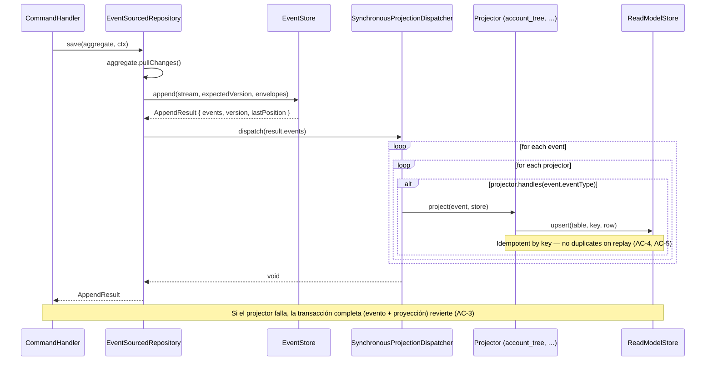
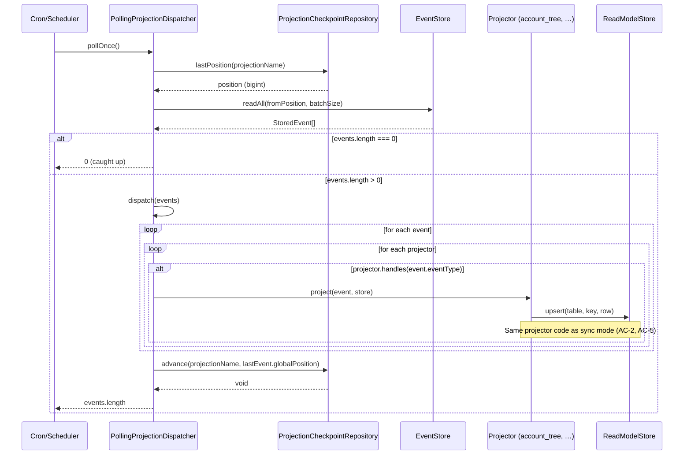
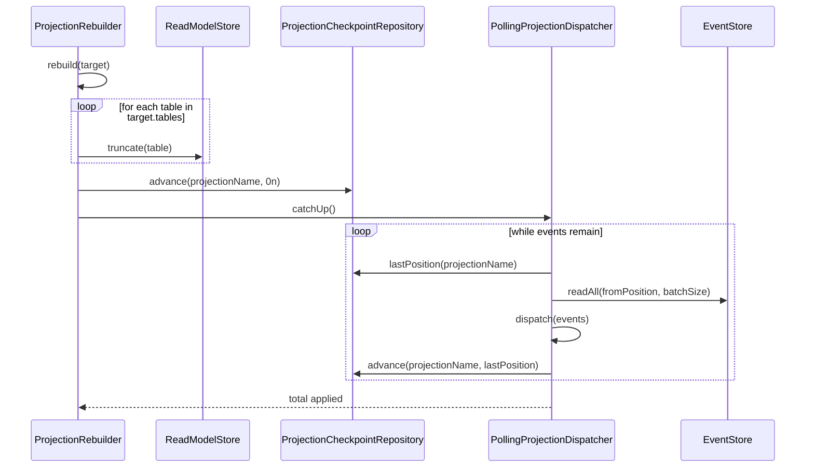

# Diagrama de flujo: hu-0004

## Proyección síncrona (en transacción del command, RNF-9)

## Proyección asíncrona (polling con checkpoint)

## Rebuild completo (RNF-5)

> **Nota:** Este es un flujo interno de `apps/ledger`. No hay comunicación entre microservicios.
> El mismo código de projector (AC-2) se ejecuta idénticamente en modo síncrono y asíncrono;
> el modo es configuración del dispatcher, nunca una bifurcación en el projector (AC-5).
