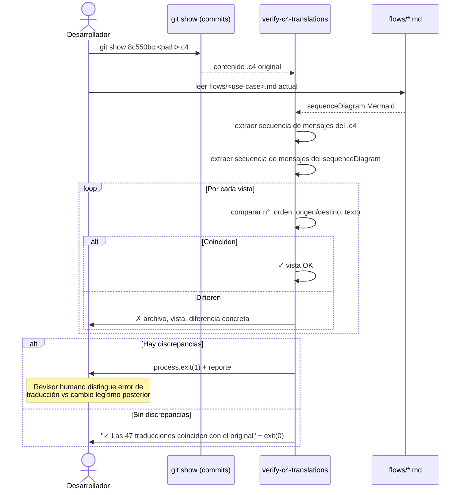

# Diagrama de flujo: spec-0034

## Verificación bidireccional de documentación (AC-2)

El gate `validate-diagrams.ts` tras spec-0034 corre en **dos direcciones** sobre cada
unidad de documentación. Arriba: el flujo forward (diagrama → código) ya existente. Abajo:
la nueva dirección inversa (código → diagrama) que reporta símbolos sin documentar.

```mermaid
sequenceDiagram
  actor CI as CI pipeline
  participant Main as main()
  participant Coll as collectSymbols
  participant Walk as walk
  participant Val as validateFile
  participant Ext as extractIdentifiers
  participant Rev as collectDocumentedSymbols
  participant Fwd as validateForward

  CI->>Main: npm run docs:validate

  loop Por cada unidad (UNITS)
    Main->>Coll: collectSymbols(unit.roots + SHARED_ROOTS)
    Coll->>Walk: walk(root, '.ts')
    Walk-->>Coll: archivos .ts
    Coll-->>Main: Set&lt;string&gt; (todos los exports)

    Main->>Rev: collectDocumentedSymbols(unit.root, '.md')
    Rev->>Walk: walk(unit.root, '.md')
    Walk-->>Rev: archivos .md
    loop Por cada .md
      Rev->>Rev: extractIdentifiers(bloque mermaid)
    end
    Rev-->>Main: Set&lt;string&gt; (identificadores referenciados)

    Main->>Coll: collectDocumentableSymbols(unit.roots)
    Note over Main,Coll: Filtra solo *.handler.ts, *.controller.ts, *.projector.ts

    loop Por cada símbolo documentable
      alt No aparece en documentedSymbols
        Main->>Main: finding → reporta "sin documentar"
      end
    end

    loop Por cada archivo .md de la unidad
      Main->>Val: validateFile(file, content, symbols)
      Val->>Ext: extractIdentifiers(bloque mermaid)
      loop Por cada identificador
        alt No existe en symbols
          Val->>Main: Finding (referencia rota)
        end
      end
    end
  end

  alt findings.length > 0
    Main->>CI: process.exit(1) + errores
  else
    Main->>CI: "✓ Everything resolves" + exit(0)
  end
```

## Verificación de traducciones LikeC4 → Mermaid (AC-1)

Script puntual (`tools/verify-c4-translations.ts`) que compara cada `dynamic view` original
con su `sequenceDiagram` traducido.


