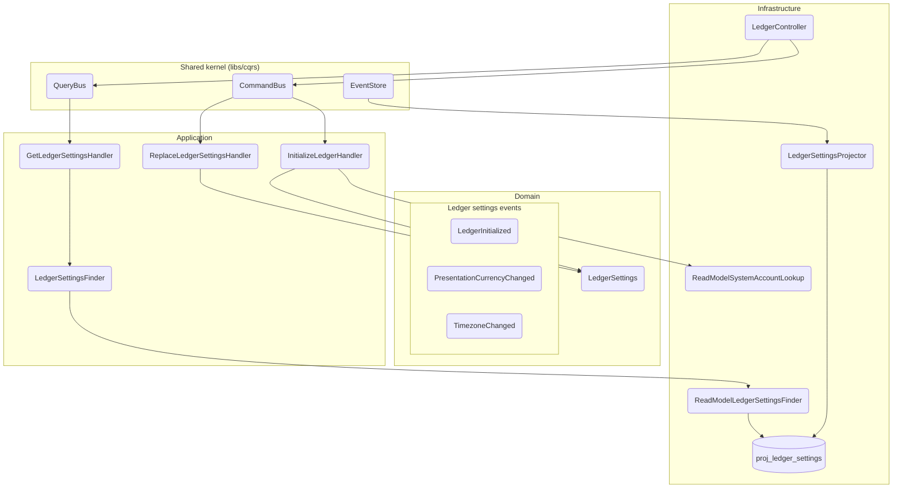
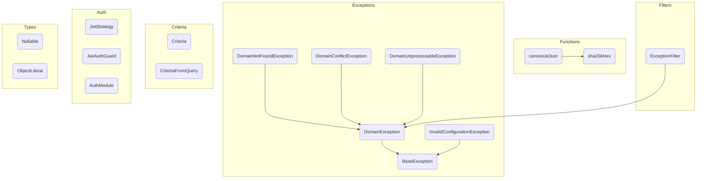

# sm-0034: Cerrar las validaciones pendientes de la documentación — Plan de Implementación

**Historia:** `work/active/spec-0034/`
**Componente(s):** monorepo raíz — `tools/`, `apps/ledger/docs/`, `libs/shared/docs/`
**Objetivo:** Extender el gate de validación de diagramas en dirección inversa (código → diagrama), verificar la fidelidad de las 47 traducciones LikeC4→Mermaid, y crear unidades de documentación para `src/ledger` y `libs/shared`.
**Arquitectura:** Scripts CLI en `tools/` que operan sobre el filesystem (sin NestJS, sin BD). El validador existente gana dos funciones nuevas (`collectDocumentedSymbols`, `collectDocumentableSymbols`) y un loop inverso en `main()`. El script de traducciones (`verify-c4-translations.ts`) es independiente y se ejecuta una vez comparando `.c4` recuperados de git contra `flows/*.md`.
**Stack:** TypeScript · Node.js (CLI) · Jest · sin ORM ni DB

### Trazabilidad AC → Tareas

| AC | Cubierto por |
|----|-------------|
| AC-1 | Tarea 7 |
| AC-2 | Tarea 5, Tarea 6 |
| AC-3 | Tarea 1, Tarea 3, Tarea 4 |
| AC-4 | Tarea 2, Tarea 4 |
| AC-5 | Tarea 5 |

---

### Tarea 0: Preparar rama de trabajo [X]

> Al ejecutar este plan, solicitar al usuario el nombre de la rama antes de continuar.

**Preguntar:** "¿Cuál es el nombre de la rama? (ej: feat/SPEC-0034-docs-validation-gaps)"

**Step 1: Verificar que la base esté fresca (read-only)**

```bash
git branch --show-current
git status --porcelain
```

Esperado: en `develop` (o la base que corresponda), working tree limpio. Si no lo está → detener y recomendar `/prepare`.

**Step 2: Crear rama de trabajo**

```bash
git checkout -b <nombre-de-rama-dado-por-usuario>
```

Esperado: rama nueva creada y activa.

---

### Tarea 1: Crear unidad de documentación `apps/ledger/docs/ledger/` (AC-3) [X]

**Archivos:**
- Crear: `apps/ledger/docs/ledger/README.md`
- Mover: `apps/ledger/docs/accounts/flows/get-ledger-settings.md` → `apps/ledger/docs/ledger/flows/get-ledger-settings.md`
- Mover: `apps/ledger/docs/accounts/flows/initialize-ledger.md` → `apps/ledger/docs/ledger/flows/initialize-ledger.md`
- Mover: `apps/ledger/docs/accounts/flows/replace-ledger-settings.md` → `apps/ledger/docs/ledger/flows/replace-ledger-settings.md`

**Step 1: Crear directorios**

```bash
New-Item -ItemType Directory -Force -Path "apps/ledger/docs/ledger/flows"
```

**Step 2: Crear README.md con diagrama de componentes**

En `apps/ledger/docs/ledger/README.md`:

```markdown
# Módulo: ledger (apps/ledger)

> C4 Nivel 3 · documentación viva. El diagrama de componentes vive acá; cada flujo lleva
> su diagrama de secuencia inline en [`flows/`](./flows/). Este README es el arc42-lite
> del módulo: propósito, invariantes y lenguaje ubicuo.

## Propósito

Gestiona el ciclo de vida a nivel ledger: inicialización (crea las cuentas técnicas de
sistema `Equity:OpeningBalances` y `Equity:Adjustments`), lectura y reemplazo de settings
(moneda de presentación, timezone). Es un módulo event-sourced: cada transición de estado
emite un evento de dominio persistido en el `EventStore`.

## Diagramas

**Componentes (C4 Nivel 3).** Los nodos nombran la clase real; el gate de CI
(`npm run docs:validate`) falla si alguno deja de existir.



## Casos de uso (flujos)

| Flujo | Trigger | Endpoint | Command |
|---|---|---|---|
| [`initialize-ledger`](./flows/initialize-ledger.md) | rest | `POST /ledger/initialize` | `InitializeLedgerCommand` |
| [`get-ledger-settings`](./flows/get-ledger-settings.md) | rest | `GET /ledger/settings` | `GetLedgerSettingsQuery` |
| [`replace-ledger-settings`](./flows/replace-ledger-settings.md) | rest | `PUT /ledger/settings` | `ReplaceLedgerSettingsCommand` |
```

**Step 3: Migrar los 3 flujos desde `docs/accounts/flows/`**

Mover cada archivo y actualizar su frontmatter (`module: accounts` → `module: ledger`):

```bash
Move-Item -LiteralPath "apps/ledger/docs/accounts/flows/get-ledger-settings.md" -Destination "apps/ledger/docs/ledger/flows/get-ledger-settings.md"
Move-Item -LiteralPath "apps/ledger/docs/accounts/flows/initialize-ledger.md" -Destination "apps/ledger/docs/ledger/flows/initialize-ledger.md"
Move-Item -LiteralPath "apps/ledger/docs/accounts/flows/replace-ledger-settings.md" -Destination "apps/ledger/docs/ledger/flows/replace-ledger-settings.md"
```

Editar el frontmatter de cada archivo: cambiar `module: accounts` por `module: ledger`.

**Step 4: Verificar que el directorio `accounts/flows/` quedó con 7 archivos**

```bash
Get-ChildItem -LiteralPath "apps/ledger/docs/accounts/flows" | Measure-Object | Select-Object -ExpandProperty Count
```

Esperado: `7`

---

### Tarea 2: Crear unidad de documentación `libs/shared/docs/` (AC-4) [X]

**Archivos:**
- Crear: `libs/shared/docs/README.md`

**Step 1: Crear directorio**

```bash
New-Item -ItemType Directory -Force -Path "libs/shared/docs"
```

**Step 2: Crear README.md con diagrama de componentes**

En `libs/shared/docs/README.md`:

```markdown
# libs/shared — Utilidades transversales del monorepo

> C4 Nivel 3 · documentación viva. Los nodos nombran la clase real; el gate de CI
> (`npm run docs:validate`) falla si alguno deja de existir.

## Propósito

Librería compartida entre `apps/finances` y `apps/ledger`. Provee tipos genéricos
(`Nullable<T>`, `ObjectLiteral`), jerarquía de excepciones de dominio
(`DomainException`, `BaseException`), filtro global de errores HTTP
(`ExceptionFilter`), funciones de hashing criptográfico (`canonicalJson`, `sha256Hex`),
el patrón `Criteria` para queries tipadas, y el módulo de autenticación OIDC
(`AuthModule`, `JwtStrategy`).

No contiene handlers, controllers ni projectors — es una librería de soporte, no un
módulo de negocio. El gate inverso (código → diagrama) no le aplica.

## Diagramas

**Componentes (C4 Nivel 3).**



## Notas

- `Money` existe en dos versiones independientes: `apps/finances/src/shared/domain/money.ts`
  (basada en `number`) y `apps/ledger/src/shared/domain/money/money.ts` (basada en `Big`).
  Los diagramas de cada app referencian su propia versión.
- Esta unidad no tiene `flows/` porque no expone casos de uso propios. Los símbolos que
  otras unidades nombran (`canonicalJson`, `sha256Hex`, `DomainException`) están
  documentados en el diagrama de componentes de arriba.
```

**Step 3: Verificar creación**

```bash
Test-Path -LiteralPath "libs/shared/docs/README.md"
```

Esperado: `True`

---

### Tarea 3: Actualizar READMEs existentes (AC-3) [X]

**Archivos:**
- Modificar: `apps/ledger/docs/shared/README.md`
- Modificar: `apps/ledger/docs/accounts/README.md`

**Step 1: Agregar justificación del mapeo N:1 en `docs/shared/README.md`**

En `apps/ledger/docs/shared/README.md`, tras la línea "Es el glue que conecta NestJS con el núcleo hexagonal de [`libs/cqrs`]", insertar:

```markdown
Esta unidad documenta tres raíces de código:
- **`apps/ledger/src/shared`** — el kernel HTTP del ledger (guard, interceptor, decoradores
  de contexto, DTO de respuesta de escritura) y el dominio compartido (`Money`, `LedgerContext`).
- **`apps/ledger/src/config`** — el bootstrap de Swagger (`buildSwaggerDocument`,
  `maybeMountSwagger`). Vive acá en vez de en su propia unidad porque es configuración de
  infraestructura sin casos de uso propios.
- **`apps/ledger/src/tooling`** — los verificadores CLI (`ChainVerifier`,
  `ConsistencyVerifier`). Están acá por la misma razón: son tooling de build, no módulos
  de negocio.
```

**Step 2: Actualizar `docs/accounts/README.md` — quitar referencias al ledger**

En `apps/ledger/docs/accounts/README.md`:

- Eliminar el párrafo bajo "Propósito" que dice "Aloja además el **ciclo de vida a nivel ledger** (`LedgerController`): inicialización y lectura de settings. Vive acá por cercanía — el efecto observable de inicializar es la aparición de las cuentas técnicas de sistema."
- En el diagrama Mermaid, eliminar los nodos `LC("LedgerController")`, `IH("InitializeLedgerHandler")`, y las aristas `LC --> CB`, `LC --> QB`, `CB --> IH`.
- En la tabla de casos de uso, eliminar las filas de `initialize-ledger`, `get-ledger-settings` y `replace-ledger-settings`.

---

### Tarea 4: Actualizar `UNITS` y `SHARED_ROOTS` en `validate-diagrams.ts` (AC-3, AC-4) [X]

**Archivos:**
- Modificar: `tools/validate-diagrams.ts`

**Step 1: Actualizar el mapa `UNITS`**

Reemplazar el bloque `UNITS` actual (líneas 18-31) con:

```typescript
const UNITS: Record<string, string[]> = {
  'apps/ledger/docs/accounts': ['apps/ledger/src/accounts'],
  'apps/ledger/docs/ledger': ['apps/ledger/src/ledger'],
  'apps/ledger/docs/reconciliation': ['apps/ledger/src/reconciliation'],
  'apps/ledger/docs/reference': ['apps/ledger/src/reference'],
  // `shared` documents the cross-cutting ledger surface: the HTTP kernel (src/shared),
  // the Swagger bootstrap (src/config) and the CLI verifiers (src/tooling).
  'apps/ledger/docs/shared': [
    'apps/ledger/src/shared',
    'apps/ledger/src/config',
    'apps/ledger/src/tooling',
  ],
  'apps/ledger/docs/transactions': ['apps/ledger/src/transactions'],
  'libs/cqrs/docs': ['libs/cqrs/src'],
  'libs/shared/docs': ['libs/shared/src'],
};
```

Cambios respecto al original:
- `accounts` ya no incluye `apps/ledger/src/ledger` (ahora tiene su propia unidad)
- Nueva entrada `'apps/ledger/docs/ledger': ['apps/ledger/src/ledger']`
- Nueva entrada `'libs/shared/docs': ['libs/shared/src']`

**Step 2: Actualizar `SHARED_ROOTS`**

Reemplazar línea 37:

```typescript
const SHARED_ROOTS = ['libs/cqrs/src', 'apps/ledger/src/shared'];
```

`libs/shared/src` se quita porque ahora tiene su propia unidad.

**Step 3: Actualizar el comentario JSDoc de `UNITS`**

Reemplazar el comentario de líneas 9-17 con:

```typescript
/**
 * Documentation unit -> the code roots it documents. Explicit on purpose: implicit
 * derivation from the folder name is what let apps/ledger/docs/shared-kernel/ survive
 * for two weeks describing code that had already moved to libs/cqrs.
 *
 * Every unit is 1:1 except `shared`, whose README documents why it also covers
 * `src/config` and `src/tooling`.
 */
```

**Step 4: Ejecutar el gate forward para verificar que sigue pasando**

```bash
npx ts-node -P tools/tsconfig.tools.json tools/validate-diagrams.ts
```

Esperado: `✓ Every Mermaid identifier resolves to a real symbol.` (exit 0). Si hay fallos, son preexistentes y no introducidos por este cambio — verificar que los fallos ya existían antes.

---

### Tarea 5: Escribir tests del gate inverso y cobertura negativa (AC-5 — TDD) [X]

**Archivos:**
- Modificar: `tools/validate-diagrams.spec.ts`

**Step 1: Escribir tests para `collectDocumentableSymbols` (fallan — función no existe aún)**

Agregar al final de `tools/validate-diagrams.spec.ts`, antes del cierre del archivo:

```typescript
describe('collectDocumentableSymbols', () => {
  it('indexes exports from *.handler.ts files', () => {
    const sources = ['export class InitializeLedgerHandler {}'];
    const roots = ['fake/handlers'];
    // Uses the opts.sources bypass like collectSymbols does
    const symbols = (collectDocumentableSymbols as any)(roots, {
      sources,
      fileNames: ['fake/handlers/initialize-ledger.handler.ts'],
    });
    expect(symbols).toContain('InitializeLedgerHandler');
  });

  it('indexes exports from *.controller.ts files', () => {
    const sources = ['export class LedgerController {}'];
    const symbols = (collectDocumentableSymbols as any)(['fake'], {
      sources,
      fileNames: ['fake/ledger.controller.ts'],
    });
    expect(symbols).toContain('LedgerController');
  });

  it('indexes exports from *.projector.ts files', () => {
    const sources = ['export class LedgerSettingsProjector {}'];
    const symbols = (collectDocumentableSymbols as any)(['fake'], {
      sources,
      fileNames: ['fake/ledger-settings.projector.ts'],
    });
    expect(symbols).toContain('LedgerSettingsProjector');
  });

  it('ignores exports from other file patterns (ports, aggregates, DTOs)', () => {
    const sources = [
      'export abstract class LedgerSettingsFinder {}',
      'export class LedgerSettings {}',
      'export class LedgerSettingsDto {}',
    ];
    const symbols = (collectDocumentableSymbols as any)(['fake'], {
      sources,
      fileNames: [
        'fake/ledger-settings-finder.port.ts',
        'fake/ledger-settings.aggregate.ts',
        'fake/ledger-settings.dto.ts',
      ],
    });
    expect(symbols.size).toBe(0);
  });

  it('returns empty when no matching files exist', () => {
    const symbols = (collectDocumentableSymbols as any)(['does/not/exist']);
    expect(symbols.size).toBe(0);
  });

  it('skips .spec.ts files even when they match the pattern', () => {
    const sources = ['export const mock = {};'];
    const symbols = (collectDocumentableSymbols as any)(['fake'], {
      sources,
      fileNames: ['fake/test.handler.spec.ts'],
    });
    expect(symbols.size).toBe(0);
  });
});
```

**Step 2: Escribir tests para `collectDocumentedSymbols` (fallan — función no existe aún)**

```typescript
describe('collectDocumentedSymbols', () => {
  it('collects identifiers from mermaid blocks in .md files', () => {
    const mdContent = [
      '# Title',
      '```mermaid',
      'flowchart TB',
      '  A("InitializeLedgerHandler")',
      '```',
      'prose',
      '```mermaid',
      'sequenceDiagram',
      '  participant LC as LedgerController',
      '```',
    ].join('\n');
    const symbols = (collectDocumentedSymbols as any)(['fake/docs'], {
      sources: { 'fake/docs/flow.md': mdContent },
    });
    expect(symbols).toContain('InitializeLedgerHandler');
    expect(symbols).toContain('LedgerController');
  });

  it('returns empty when no .md files contain mermaid blocks', () => {
    const symbols = (collectDocumentedSymbols as any)(['fake/docs'], {
      sources: { 'fake/docs/readme.md': '# Just prose, no diagram' },
    });
    expect(symbols.size).toBe(0);
  });

  it('returns empty for a directory that does not exist', () => {
    const symbols = (collectDocumentedSymbols as any)(['does/not/exist']);
    expect(symbols.size).toBe(0);
  });
});
```

**Step 3: Escribir test de integración para `runReverseGate` (falla — función no existe aún)**

```typescript
describe('runReverseGate', () => {
  it('reports documentable symbols not referenced in any mermaid block', () => {
    const docRoot = 'fake/docs/ledger';
    const codeRoots = ['fake/src/ledger'];
    const sharedRoots: string[] = [];

    const codeSources = ['export class MissingHandler {}'];
    const codeFileNames = ['fake/src/ledger/missing.handler.ts'];

    const docSources = {
      'fake/docs/ledger/flow.md': [
        '# Flow',
        '```mermaid',
        'sequenceDiagram',
        '  participant C as LedgerController',
        '```',
      ].join('\n'),
    };

    const findings = (runReverseGate as any)(docRoot, codeRoots, sharedRoots, {
      codeSources,
      codeFileNames,
      docSources,
    });

    expect(findings).toEqual([
      { file: `${docRoot}`, line: 0, name: 'MissingHandler' },
    ]);
  });

  it('reports nothing when all documentable symbols are referenced', () => {
    const docRoot = 'fake/docs/ledger';
    const codeRoots = ['fake/src/ledger'];
    const sharedRoots: string[] = [];

    const codeSources = ['export class LedgerController {}'];
    const codeFileNames = ['fake/src/ledger/ledger.controller.ts'];

    const docSources = {
      'fake/docs/ledger/flow.md': [
        '# Flow',
        '```mermaid',
        'sequenceDiagram',
        '  participant LC as LedgerController',
        '```',
      ].join('\n'),
    };

    const findings = (runReverseGate as any)(docRoot, codeRoots, sharedRoots, {
      codeSources,
      codeFileNames,
      docSources,
    });

    expect(findings).toEqual([]);
  });

  it('reports nothing when the unit has no documentable symbols', () => {
    const docRoot = 'fake/docs/shared';
    const codeRoots = ['fake/src/shared'];
    const sharedRoots: string[] = [];

    // No handler/controller/projector files — the unit has nothing documentable
    const codeSources = ['export class DomainException {}'];
    const codeFileNames = ['fake/src/shared/domain.exception.ts'];

    const docSources = {};

    const findings = (runReverseGate as any)(docRoot, codeRoots, sharedRoots, {
      codeSources,
      codeFileNames,
      docSources,
    });

    expect(findings).toEqual([]);
  });
});
```

**Step 4: Ejecutar tests y confirmar que fallan**

```bash
npx jest tools/validate-diagrams.spec.ts --no-coverage
```

Esperado: FAIL — `collectDocumentableSymbols is not a function`, `collectDocumentedSymbols is not a function`, `runReverseGate is not a function`.

---

### Tarea 6: Implementar el gate inverso (AC-2) [X]

**Archivos:**
- Modificar: `tools/validate-diagrams.ts`

**Step 1: Agregar `DOCUMENTABLE_PATTERN`**

Insertar después de `DECLARATION` (línea 43):

```typescript
/** Files whose exported symbols the reverse gate requires to appear in some Mermaid block. */
const DOCUMENTABLE_PATTERN = /\.(handler|controller|projector)\.ts$/;
```

**Step 2: Agregar `collectDocumentedSymbols`**

Insertar después de `collectSymbols` (después de línea 89):

```typescript
/**
 * Collects every identifier that appears in Mermaid blocks across all .md files
 * under `docRoot`. This is the "already documented" side of the reverse gate.
 */
export function collectDocumentedSymbols(
  docRoot: string,
  opts: { sources?: Record<string, string> } = {},
): Set<string> {
  const symbols = new Set<string>();

  const files = opts.sources
    ? Object.entries(opts.sources)
    : walk(docRoot, '.md').map(
        (f): [string, string] => [f, readFileSync(f, 'utf8')],
      );

  for (const [, content] of files) {
    const lines = content.split('\n');
    let start = -1;

    lines.forEach((raw, index) => {
      const text = raw.trim();
      if (start < 0 && text.indexOf('```mermaid') === 0) {
        start = index;
        return;
      }
      if (start >= 0 && text === '```') {
        const block = lines.slice(start + 1, index).join('\n');
        for (const hit of extractIdentifiers(block)) {
          symbols.add(hit.name);
        }
        start = -1;
      }
    });
  }

  return symbols;
}
```

**Step 3: Agregar `collectDocumentableSymbols`**

Insertar después de `collectDocumentedSymbols`:

```typescript
/**
 * Collects exported symbols from files matching {@link DOCUMENTABLE_PATTERN}
 * (handlers, controllers, projectors) across all code roots. These are the
 * symbols the reverse gate requires to appear in at least one Mermaid block.
 */
export function collectDocumentableSymbols(
  roots: string[],
  opts: { sources?: string[]; fileNames?: string[] } = {},
): Set<string> {
  const symbols = new Set<string>();

  const contents = opts.sources
    ? opts.sources
    : roots.reduce<string[]>(
        (acc, root) =>
          acc.concat(
            walk(root, '.ts')
              .filter((f) => DOCUMENTABLE_PATTERN.test(f))
              .map((f) => readFileSync(f, 'utf8')),
          ),
        [],
      );

  for (const content of contents) {
    for (const line of content.split('\n')) {
      const hit = DECLARATION.exec(line);
      if (hit) symbols.add(hit[1]);
    }
  }

  return symbols;
}
```

**Step 4: Agregar `runReverseGate`**

Insertar después de `validateFile` (después de línea 145):

```typescript
/**
 * Reverse direction of the gate: reports documentable symbols (handlers,
 * controllers, projectors) that do not appear in any Mermaid block of the unit.
 * `file` is set to `docRoot` to identify which unit the gap belongs to.
 */
export function runReverseGate(
  docRoot: string,
  codeRoots: string[],
  sharedRoots: string[],
  opts: {
    codeSources?: string[];
    codeFileNames?: string[];
    docSources?: Record<string, string>;
  } = {},
): Finding[] {
  const findings: Finding[] = [];

  const documentable = collectDocumentableSymbols(codeRoots, {
    sources: opts.codeSources,
  });
  const documented = collectDocumentedSymbols(docRoot, {
    sources: opts.docSources,
  });

  for (const name of documentable) {
    if (!documented.has(name)) {
      findings.push({ file: docRoot, line: 0, name });
    }
  }

  return findings;
}
```

**Step 5: Integrar el reverse gate en `main()`**

Reemplazar `main()` (líneas 147-170) con:

```typescript
export function main(): Finding[] {
  const all: Finding[] = [];

  for (const docRoot of Object.keys(UNITS)) {
    const codeRoots = UNITS[docRoot];
    const symbols = collectSymbols(codeRoots.concat(SHARED_ROOTS));

    // Forward: diagram -> code (existing)
    for (const file of walk(docRoot, '.md')) {
      const content = readFileSync(file, 'utf8');
      all.push(...validateFile(relative(process.cwd(), file), content, symbols));
    }

    // Reverse: code -> diagram (new)
    all.push(...runReverseGate(docRoot, codeRoots, SHARED_ROOTS));
  }

  return all;
}

if (require.main === module) {
  const findings = main();

  if (findings.length === 0) {
    console.log('✓ Every Mermaid identifier resolves to a real symbol, and every documentable symbol is documented.');
    return;
  }

  // Walk everything and report every break before exiting -- the same CLI convention the
  // repo's other verification tooling already follows.
  for (const f of findings) {
    if (f.line === 0) {
      console.error(`✗ ${f.file} — "${f.name}" is not referenced in any diagram of this unit`);
    } else {
      console.error(`✗ ${f.file}:${f.line} — "${f.name}" does not resolve to a known symbol`);
    }
  }
  console.error(`\n${findings.length} issue(s).`);
  process.exit(1);
}
```

Cambios respecto al original:
- `main()` ahora retorna `Finding[]` en vez de `void` (testeable)
- El bloque `if (require.main === module)` llama a `main()` y maneja `process.exit`
- Se agregó el loop inverso (`runReverseGate`) en cada unidad
- Se diferencia la salida: `line: 0` indica símbolo sin documentar (reverse), `line > 0` indica referencia rota (forward)
- El mensaje de éxito se actualizó para reflejar ambas direcciones

**Step 6: Ejecutar tests y confirmar que pasan**

```bash
npx jest tools/validate-diagrams.spec.ts --no-coverage
```

Esperado: PASS — todos los tests, incluyendo los nuevos de la Tarea 5.

**Step 7: Ejecutar el gate completo y verificar**

```bash
npx ts-node -P tools/tsconfig.tools.json tools/validate-diagrams.ts
```

Esperado: exit 0 o exit 1 con reporte de gaps legítimos. Si hay gaps, verificar que correspondan a código realmente indocumentado (no falsos positivos).

---

### Tarea 7: Crear script de verificación de traducciones (AC-1) [X]

**Archivos:**
- Crear: `tools/verify-c4-translations.ts`
- Crear: `tools/verify-c4-translations.spec.ts`

**Step 1: Escribir el test que falla**

En `tools/verify-c4-translations.spec.ts`:

```typescript
import { compareView, extractC4Messages, extractMermaidMessages, C4Message, ViewComparison } from './verify-c4-translations';

describe('extractC4Messages', () => {
  it('extracts message sequences from a LikeC4 dynamic view', () => {
    const c4 = `
dynamic view openAccount {
  title 'Abrir cuenta'
  client -> controller 'POST /accounts'
  controller -> commandBus 'dispatch(OpenAccountCommand)'
  commandBus -> handler 'execute(command)'
  handler -> repository 'save(account)'
}
`;
    const messages = extractC4Messages(c4, 'openAccount');
    expect(messages).toEqual([
      { from: 'client', to: 'controller', text: 'POST /accounts' },
      { from: 'controller', to: 'commandBus', text: 'dispatch(OpenAccountCommand)' },
      { from: 'commandBus', to: 'handler', text: 'execute(command)' },
      { from: 'handler', to: 'repository', text: 'save(account)' },
    ]);
  });

  it('returns empty array when the view is not found', () => {
    const c4 = 'dynamic view other { client -> svc "call" }';
    expect(extractC4Messages(c4, 'missing')).toEqual([]);
  });

  it('skips lines that are not message arrows', () => {
    const c4 = `
dynamic view simple {
  title 'Simple'
  client -> svc 'do'
  note: 'some comment'
}
`;
    const messages = extractC4Messages(c4, 'simple');
    expect(messages).toEqual([{ from: 'client', to: 'svc', text: 'do' }]);
  });
});

describe('extractMermaidMessages', () => {
  it('extracts message sequences from a Mermaid sequenceDiagram', () => {
    const mermaid = [
      'sequenceDiagram',
      '  actor Client',
      '  participant C as LedgerController',
      '  participant CB as CommandBus',
      '  Client->>C: POST /ledger/initialize',
      '  C->>CB: dispatch(InitializeLedgerCommand)',
    ].join('\n');
    const messages = extractMermaidMessages(mermaid);
    expect(messages).toEqual([
      { from: 'Client', to: 'LedgerController', text: 'POST /ledger/initialize' },
      { from: 'LedgerController', to: 'CommandBus', text: 'dispatch(InitializeLedgerCommand)' },
    ]);
  });

  it('resolves participant aliases via "as"', () => {
    const mermaid = [
      'sequenceDiagram',
      '  participant C as LedgerController',
      '  participant B as CommandBus',
      '  C->>B: dispatch(cmd)',
    ].join('\n');
    const messages = extractMermaidMessages(mermaid);
    expect(messages).toEqual([
      { from: 'LedgerController', to: 'CommandBus', text: 'dispatch(cmd)' },
    ]);
  });

  it('ignores Notes and activation markers', () => {
    const mermaid = [
      'sequenceDiagram',
      '  participant S as Service',
      '  Note over S: thinking',
      '  activate S',
      '  Client->>S: request',
      '  deactivate S',
    ].join('\n');
    const messages = extractMermaidMessages(mermaid);
    expect(messages).toEqual([{ from: 'Client', to: 'Service', text: 'request' }]);
  });

  it('returns empty for non-mermaid blocks', () => {
    expect(extractMermaidMessages('just prose')).toEqual([]);
  });
});

describe('compareView', () => {
  it('reports matching sequences as no discrepancy', () => {
    const c4: C4Message[] = [
      { from: 'client', to: 'controller', text: 'POST /x' },
      { from: 'controller', to: 'bus', text: 'dispatch(cmd)' },
    ];
    const mermaid: C4Message[] = [
      { from: 'Client', to: 'Controller', text: 'POST /x' },
      { from: 'Controller', to: 'CommandBus', text: 'dispatch(cmd)' },
    ];
    const result = compareView('test', c4, mermaid);
    expect(result.discrepancies).toEqual([]);
    expect(result.match).toBe(true);
  });

  it('reports difference in message count', () => {
    const c4: C4Message[] = [{ from: 'a', to: 'b', text: 'msg1' }];
    const mermaid: C4Message[] = [
      { from: 'A', to: 'B', text: 'msg1' },
      { from: 'B', to: 'C', text: 'msg2' },
    ];
    const result = compareView('test', c4, mermaid);
    expect(result.match).toBe(false);
    expect(result.discrepancies).toContainEqual(
      expect.stringContaining('message count'),
    );
  });

  it('reports difference in message text', () => {
    const c4: C4Message[] = [{ from: 'a', to: 'b', text: 'old text' }];
    const mermaid: C4Message[] = [{ from: 'A', to: 'B', text: 'new text' }];
    const result = compareView('test', c4, mermaid);
    expect(result.match).toBe(false);
    expect(result.discrepancies).toContainEqual(
      expect.stringContaining('text'),
    );
  });
});
```

**Step 2: Ejecutar y confirmar que falla**

```bash
npx jest tools/verify-c4-translations.spec.ts --no-coverage
```

Esperado: FAIL — "Cannot find module './verify-c4-translations'".

**Step 3: Implementar el script**

En `tools/verify-c4-translations.ts`:

```typescript
/**
 * One-time verification script: compares the original LikeC4 dynamic views
 * (recovered from git) against the current Mermaid sequenceDiagrams to detect
 * translation errors introduced during the spec-0033 migration.
 *
 * Usage: npx ts-node -P tools/tsconfig.tools.json tools/verify-c4-translations.ts
 *
 * The .c4 files were deleted in commits 8c550bc, ebb2b1e, 9e7fd3a and 7172c28
 * of the docs/SPEC-0033-mermaid-diagrams branch. Recover them with:
 *   git show <commit>:<path>.c4
 */
import { readFileSync } from 'fs';
import { join } from 'path';

export interface C4Message {
  from: string;
  to: string;
  text: string;
}

export interface ViewComparison {
  view: string;
  match: boolean;
  discrepancies: string[];
}

/**
 * Maps a LikeC4 view id to its corresponding flows/*.md file.
 * Built from the 47 views that were translated in spec-0033.
 */
const C4_VIEW_MAP: Record<string, string> = {
  openAccount: 'apps/ledger/docs/accounts/flows/open-account.md',
  renameAccount: 'apps/ledger/docs/accounts/flows/rename-account.md',
  closeAccount: 'apps/ledger/docs/accounts/flows/close-account.md',
  getAccountById: 'apps/ledger/docs/accounts/flows/get-account-by-id.md',
  listAccounts: 'apps/ledger/docs/accounts/flows/list-accounts.md',
  getAccountBalances: 'apps/ledger/docs/accounts/flows/get-account-balances.md',
  recordOpeningBalance: 'apps/ledger/docs/accounts/flows/record-opening-balance.md',
  initializeLedger: 'apps/ledger/docs/ledger/flows/initialize-ledger.md',
  getLedgerSettings: 'apps/ledger/docs/ledger/flows/get-ledger-settings.md',
  replaceLedgerSettings: 'apps/ledger/docs/ledger/flows/replace-ledger-settings.md',
  recordTransaction: 'apps/ledger/docs/transactions/flows/record-transaction.md',
  confirmTransaction: 'apps/ledger/docs/transactions/flows/confirm-transaction.md',
  reverseTransaction: 'apps/ledger/docs/transactions/flows/reverse-transaction.md',
  voidTransaction: 'apps/ledger/docs/transactions/flows/void-transaction.md',
  amendTransaction: 'apps/ledger/docs/transactions/flows/amend-transaction.md',
  annotateTransaction: 'apps/ledger/docs/transactions/flows/annotate-transaction.md',
  getTransaction: 'apps/ledger/docs/transactions/flows/get-transaction.md',
  listTransactions: 'apps/ledger/docs/transactions/flows/list-transactions.md',
  mergeTransfers: 'apps/ledger/docs/transactions/flows/merge-transfers.md',
  registerCurrency: 'apps/ledger/docs/reference/flows/register-currency.md',
  listCurrencies: 'apps/ledger/docs/reference/flows/list-currencies.md',
  assertBalance: 'apps/ledger/docs/reconciliation/flows/assert-balance.md',
  resolveDiscrepancy: 'apps/ledger/docs/reconciliation/flows/resolve-discrepancy.md',
  revokeAssertion: 'apps/ledger/docs/reconciliation/flows/revoke-assertion.md',
  evaluateAssertion: 'apps/ledger/docs/reconciliation/flows/evaluate-assertion.md',
  listAssertions: 'apps/ledger/docs/reconciliation/flows/list-assertions.md',
  getAssertionStatus: 'apps/ledger/docs/reconciliation/flows/get-assertion-status.md',
  reevaluateAssertions: 'apps/ledger/docs/reconciliation/flows/reevaluate-assertions.md',
  runReconciliationPump: 'apps/ledger/docs/reconciliation/flows/run-reconciliation-pump.md',
  commandDispatch: 'apps/ledger/docs/shared/flows/command-dispatch.md',
  queryDispatch: 'apps/ledger/docs/shared/flows/query-dispatch.md',
  dryRunPreview: 'apps/ledger/docs/shared/flows/dry-run-preview.md',
  idempotentWrite: 'apps/ledger/docs/shared/flows/idempotent-write.md',
  mapDomainError: 'apps/ledger/docs/shared/flows/map-domain-error.md',
  retryTransientFailure: 'apps/ledger/docs/shared/flows/retry-transient-failure.md',
  getSwaggerDocs: 'apps/ledger/docs/shared/flows/get-swagger-docs.md',
  verifyChain: 'apps/ledger/docs/shared/flows/verify-chain.md',
  verifyBalances: 'apps/ledger/docs/shared/flows/verify-balances.md',
  projectTransactionList: 'apps/ledger/docs/transactions/flows/project-transaction-list.md',
  projectAccountBalances: 'apps/ledger/docs/transactions/flows/project-account-balances.md',
  projectAssertionStatus: 'apps/ledger/docs/reconciliation/flows/project-assertion-status.md',
  projectAdjustmentAudit: 'apps/ledger/docs/reconciliation/flows/project-adjustment-audit.md',
  eventStoreAppend: 'libs/cqrs/docs/flows/event-store-append.md',
  rebuildAll: 'libs/cqrs/docs/flows/rebuild-all.md',
  rebuildProjection: 'libs/cqrs/docs/flows/rebuild-projection.md',
};

/**
 * Extracts message sequences from a LikeC4 dynamic view block.
 * Each message is a line matching: <from> -> <to> '<text>'
 */
export function extractC4Messages(content: string, viewId: string): C4Message[] {
  const messages: C4Message[] = [];
  const lines = content.split('\n');
  let inside = false;
  let depth = 0;

  for (const raw of lines) {
    const line = raw.trim();

    if (line.startsWith(`dynamic view ${viewId}`)) {
      inside = true;
      depth = (raw.match(/^\s*/)?.[0].length ?? 0);
      continue;
    }

    if (!inside) continue;

    const currentDepth = raw.match(/^\s*/)?.[0].length ?? 0;
    if (currentDepth <= depth && line.startsWith('}')) {
      inside = false;
      continue;
    }

    const arrow = /^(\S+)\s*->\s*(\S+)\s*'(.+)'$/.exec(line);
    if (arrow) {
      messages.push({ from: arrow[1], to: arrow[2], text: arrow[3] });
    }
  }

  return messages;
}

/**
 * Extracts message sequences from a Mermaid sequenceDiagram block.
 * Resolves participant aliases (via `as`) to their visible names.
 */
export function extractMermaidMessages(content: string): C4Message[] {
  const messages: C4Message[] = [];
  const lines = content.split('\n');

  let inside = false;
  const aliases = new Map<string, string>();

  for (const raw of lines) {
    const line = raw.trim();

    if (line === 'sequenceDiagram') {
      inside = true;
      continue;
    }

    if (!inside) continue;

    if (line.startsWith('```')) {
      inside = false;
      continue;
    }

    // Skip non-message lines
    if (
      line.startsWith('Note ') ||
      line.startsWith('activate ') ||
      line.startsWith('deactivate ') ||
      line.startsWith('actor ') ||
      line === ''
    ) {
      continue;
    }

    const participant = /^participant\s+(\S+)(?:\s+as\s+(.+))?$/.exec(line);
    if (participant) {
      const alias = participant[1];
      const name = (participant[2] || participant[1]).trim();
      aliases.set(alias, name);
      continue;
    }

    const arrow = /^(\S+)(?:->>|->>|-->|-->>)(\S+):\s*(.+)$/.exec(line);
    if (arrow) {
      const from = aliases.get(arrow[1]) || arrow[1];
      const to = aliases.get(arrow[2]) || arrow[2];
      messages.push({ from, to, text: arrow[3].trim() });
    }
  }

  return messages;
}

export function compareView(
  viewId: string,
  c4Messages: C4Message[],
  mermaidMessages: C4Message[],
): ViewComparison {
  const discrepancies: string[] = [];

  if (c4Messages.length !== mermaidMessages.length) {
    discrepancies.push(
      `message count: .c4 has ${c4Messages.length}, Mermaid has ${mermaidMessages.length}`,
    );
  }

  const maxLen = Math.max(c4Messages.length, mermaidMessages.length);
  for (let i = 0; i < maxLen; i++) {
    const c4 = c4Messages[i];
    const m = mermaidMessages[i];

    if (!c4 || !m) {
      discrepancies.push(`position ${i + 1}: missing in ${!c4 ? '.c4' : 'Mermaid'}`);
      continue;
    }

    if (c4.text !== m.text) {
      discrepancies.push(
        `position ${i + 1} text: .c4 "${c4.text}" vs Mermaid "${m.text}"`,
      );
    }
  }

  return {
    view: viewId,
    match: discrepancies.length === 0,
    discrepancies,
  };
}

function main(): void {
  // This script is designed to run AFTER recovering .c4 files from git.
  // The .c4 content is loaded from disk; the commit recovery is manual.
  const comparisons: ViewComparison[] = [];

  for (const [viewId, flowPath] of Object.entries(C4_VIEW_MAP)) {
    // .c4 files would be recovered to a temp dir; the script reads from there
    const c4Path = join('temp-c4-recovery', `${viewId}.c4`);
    let c4Content: string;

    try {
      c4Content = readFileSync(c4Path, 'utf8');
    } catch {
      console.error(`⚠ Cannot read ${c4Path} — recover it with git show first`);
      continue;
    }

    let mermaidContent: string;
    try {
      mermaidContent = readFileSync(flowPath, 'utf8');
    } catch {
      console.error(`⚠ Cannot read ${flowPath}`);
      continue;
    }

    const c4Messages = extractC4Messages(c4Content, viewId);
    const mermaidMessages = extractMermaidMessages(mermaidContent);
    const comparison = compareView(viewId, c4Messages, mermaidMessages);

    comparisons.push(comparison);
  }

  const failures = comparisons.filter((c) => !c.match);

  if (failures.length === 0) {
    console.log(`✓ Las ${comparisons.length} traducciones coinciden con el original.`);
    return;
  }

  for (const f of failures) {
    console.error(`✗ ${f.view}:`);
    for (const d of f.discrepancies) {
      console.error(`  - ${d}`);
    }
  }

  console.error(`\n${failures.length} view(s) with discrepancies.`);
  process.exit(1);
}

if (require.main === module) main();
```

**Step 4: Ejecutar tests y confirmar que pasan**

```bash
npx jest tools/verify-c4-translations.spec.ts --no-coverage
```

Esperado: PASS.

---

### Tarea 8: Ejecutar suite completa de tests y verificar el gate [X]

**Step 1: Ejecutar todos los tests de `tools/`**

```bash
npx jest tools/ --no-coverage
```

Esperado: PASS — todos los specs de `tools/` pasando.

**Step 2: Ejecutar el gate completo**

```bash
npx ts-node -P tools/tsconfig.tools.json tools/validate-diagrams.ts
```

Esperado: exit 0 o exit 1 con gaps documentables revisables. Si exit 1, cada gap debe corresponder a un handler/controller/projector real sin documentar — no debe haber falsos positivos.

**Step 3: Verificar consistencia de `docs:validate`**

```bash
npm run docs:validate
```

Esperado: mismo resultado que Step 2.

---
